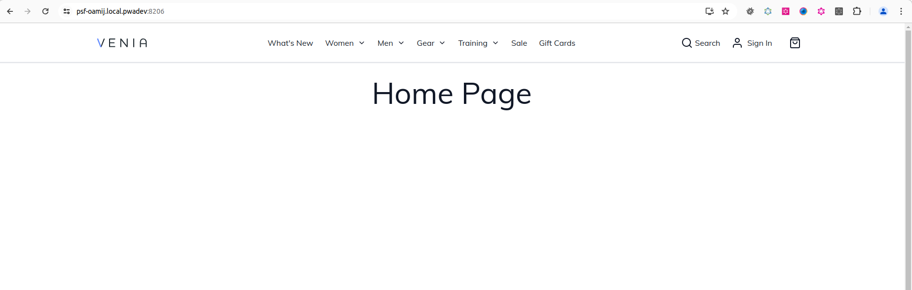
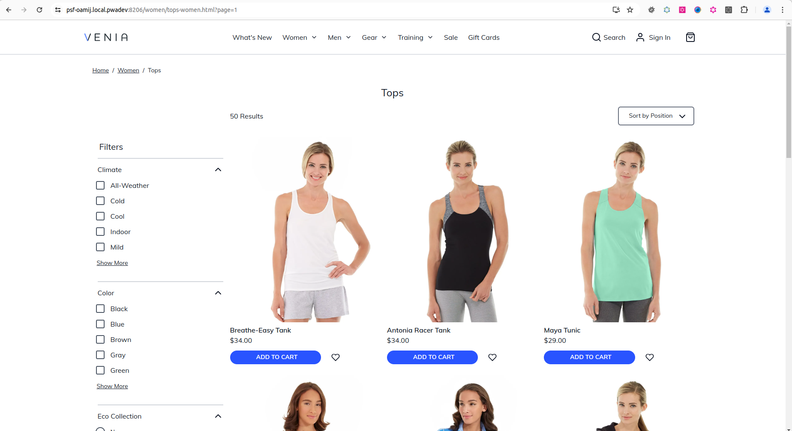
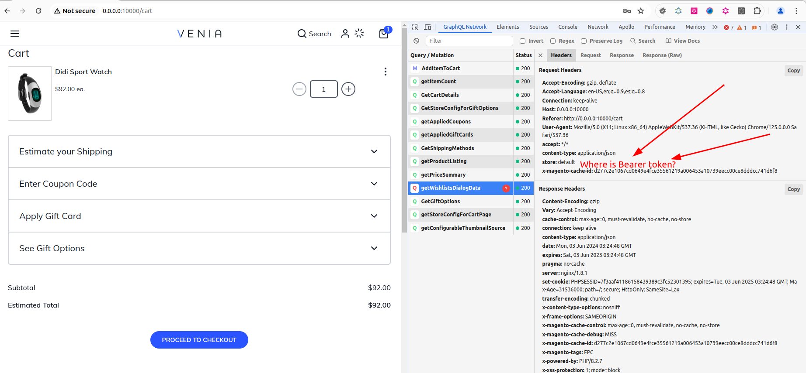
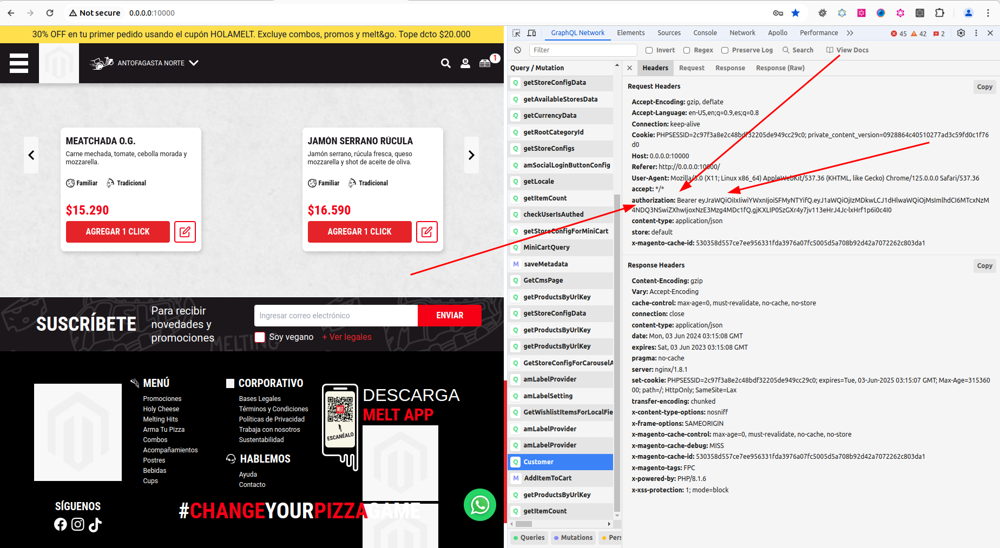

# Install PWA Venia

```text
If preferred, use oh-my-zhs terminal
https://ohmyz.sh/
```

# About Venia PWA

https://developer.adobe.com/commerce/pwa-studio/guides/

# Tutorial

https://developer.adobe.com/commerce/pwa-studio/tutorials/setup-storefront/

## yarn create @magento/pwa

```bash
mkdir pwa-dir
cd pwa-dir
yarn create @magento/pwa
# Answer the questions

success Saved lockfile.
Done in 102.74s.
  ✔  Installed dependencies for 'psf' project
  ⚠  Created new PWA project psf. Next steps:

     - cd psf > before running the below commands.

     - yarn run buildpack create-custom-origin . > to generate a unique, secure custom domain for your new project.
     Highly recommended.

     - yarn run watch > to start the dev server and do real-time development.

     - yarn run storybook > to start Storybook dev server and view available components in your app.

     - yarn run build > to build the project into optimized assets in the '/dist' directory.

     - yarn start > after build to preview the app on a local staging server.

Done in 145.73s.
```

## yarn run buildpack create-custom-origin .

```bash
yarn run buildpack create-custom-origin .
yarn run v1.22.22
$ buildpack create-custom-origin .
Creating a local development domain requires temporary administrative privileges.
Please enter the password for wolf on wolf000035.
[sudo] password for wolf: 
  ℹ  Acquired custom hostname and SSL cert for psf-oamij.local.pwadev. Development server will run on port 8206 and staging
     server will run on port 9206.
Done in 6.57s.

```

## yarn run watch

```bash
yarn run watch
yarn run v1.22.22
$ webpack-dev-server --progress --color --env.mode development
As of version 12.1.0, PWA Studio requires the appropriate PWA metapackage to be installed on the backend.
For more information, refer to the 12.1.0 release notes here: https://github.com/magento/pwa-studio/releases/tag/v12.1.0
Error: Cannot query field "newsletter_enabled" on type "StoreConfig". (... 1 errors total)
    at /home/wolf/Documentos/projects/pwa/mag246/psf/node_modules/@magento/pwa-buildpack/lib/Utilities/graphQL.js:54:21
    at processTicksAndRejections (internal/process/task_queues.js:95:5)
    at async module.exports (/home/wolf/Documentos/projects/pwa/mag246/psf/webpack.config.js:62:29)
Done in 3.15s.
```

# Install backend modules

https://developer.adobe.com/commerce/pwa-studio/metapackages/open-source/

```bash
# To much reading to only need to run the following line an upload composer.json changes XD
# + composer.lock
# On backend installation or docker, run:
composer require magento/pwa
# And also do an upgrade 
php bin/magento setup:upgrade
# For last do a reindex
php bin/magento indexer:reindex
```

# yarn run watch [again]

```bash
yarn run watch
yarn run v1.22.22
$ webpack-dev-server --progress --color --env.mode development
Emitting no ServiceWorker in development mode.
ℹ ｢wdm｣: wait until bundle finished: 
ℹ ｢wds｣: Project is running at https://psf-oamij.local.pwadev:8206/
ℹ ｢wds｣: webpack output is served from /
ℹ ｢wdm｣: Child client-config:
       1949 modules
ℹ ｢wdm｣: Compiled successfully.

                         ┌──────────────────────────────────────────────────────────────────────────────┐
                         │                                                                              │
                         │                            PWADevServer ready at                             │
                         │                     https://psf-oamij.local.pwadev:8206/                     │
                         │                                                                              │
                         │   GraphQL Playground ready at https://psf-oamij.local.pwadev:8206/graphiql   │
                         │                                                                              │
                         └──────────────────────────────────────────────────────────────────────────────┘

ℹ ｢wdm｣: Compiling...
ℹ ｢wdm｣: Child client-config:
       1949 modules
ℹ ｢wdm｣: Compiled successfully.
```

Nos go to the URL indicated in the result:
https://psf-oamij.local.pwadev:8206/
Remember that you use
> yarn run buildpack create-custom-origin

to create a secure URL

# Check the results:

Yep, home is empty



But when you check the categories, you can see the products if you can't see products, and you have added products,
please do a reindex




# Use http://0.0.0.0:10000 as PWA URL

In console where the PWA is running, stop using CTRL + C [2 times]

In file ".env" change:

```text
CUSTOM_ORIGIN_ENABLED=false
DEV_SERVER_PORT=10000
```

Run again 
> yarn run watch

And the Venia PWA is running now at
http://0.0.0.0:10000/

# Errors when user is logged in

```bash
The current customer isn't authorized.
```

## Venia with error

No Bearer token is used



## Meltpizza without error

Bearer token is used




# Install more packages

## composer require magento/pwa-commerce

## composer require magento/module-upward-connector:^2.0 --with-all-dependencies

```bash
composer require magento/module-upward-connector:^2.0 --with-all-dependencies

1 package suggestions were added by new dependencies, use `composer suggest` to see details.
Package laminas/laminas-zendframework-bridge is abandoned, you should avoid using it. No replacement was suggested.
Package sebastian/phpcpd is abandoned, you should avoid using it. No replacement was suggested.
Generating autoload files
128 packages you are using are looking for funding.
Use the `composer fund` command to find out more!
PHP CodeSniffer Config installed_paths set to ../../magento/magento-coding-standard,../../phpcompatibility/php-compatibility,../../phpcsstandards/phpcsutil
```


